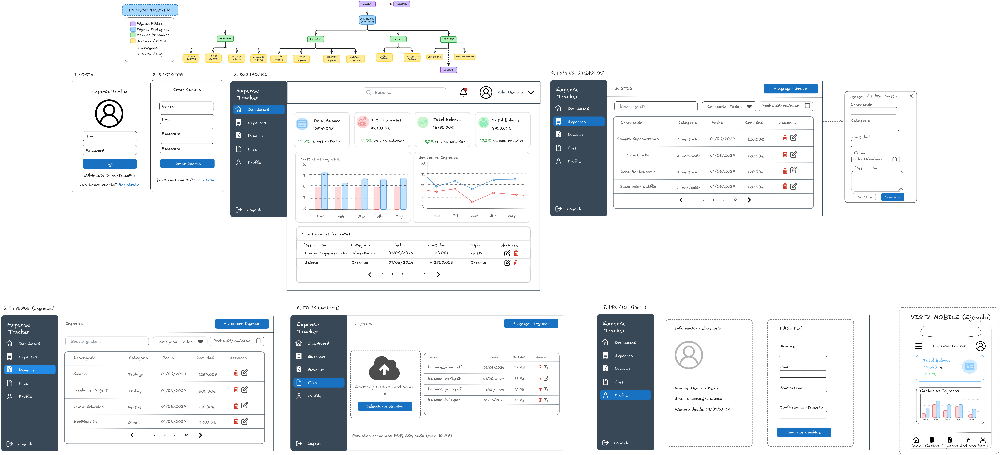

## 📐 Planificación y Arquitectura del Proyecto

Antes de iniciar la fase de desarrollo, se realizó una etapa de análisis y diseño para definir el flujo de los datos y la experiencia de usuario en el panel.

### 🔹 Diagrama de Flujo y Entidad-Relación
Este diagrama define cómo interactúan los controladores de Gastos e Ingresos, y el comportamiento de los middlewares de autenticación (`auth` y `guest`):


### 🔹 Wireframe de la Interfaz (UX/UI)
Diseño previo en baja fidelidad utilizado para estructurar de manera limpia el panel principal y la sección de gestión de archivos (`/files`), optimizando la simetría y usabilidad de los componentes:




# Expense Tracker 💰

¡Bienvenido a **Expense Tracker**! Una aplicación web full-stack diseñada para la gestión de finanzas personales, control de ingresos y gastos, y monitorización de presupuestos mensuales en tiempo real.

Este proyecto ha sido desarrollado como parte de mi progreso en el desarrollo web, aplicando buenas prácticas de arquitectura MVC, bases de datos relacionales y peticiones asíncronas.

---

## 🚀 Características Principales

* **Autenticación Segura:** Registro de usuarios, inicio de sesión y cierre de sesión protegido con el middleware de Laravel.
* **Dashboard Interactivo:** Panel de control con tarjetas de resumen (Balance Total, Gastos, Ingresos y Ahorros) y gráficos visuales dinámicos.
* **Gráficos en Tiempo Real:** Integración de **Chart.js** con gráficos de barras y líneas para comparar la evolución mensual de ingresos frente a gastos.
* **Control de Presupuesto Asíncrono:** Input en la barra de navegación que permite actualizar el límite de gasto mensual mediante **Fetch API (AJAX)** sin recargar la página.
* **Sistema de Notificaciones:** Alertas automáticas integradas en la barra superior para avisar al usuario cuando se acerca o supera su límite mensual.
* **Gestión de Archivos:** Panel para subir, almacenar y descargar archivos o facturas enlazadas a los movimientos financieros.

---

## 🛠️ Stack Tecnológico

* **Backend:** PHP 8.x | Laravel (Arquitectura MVC, Migraciones, Eloquent ORM)
* **Frontend:** Blade Templates | Bootstrap 5 | JavaScript (AJAX / Fetch API)
* **Gráficos:** Chart.js
* **Base de Datos:** MySQL

---

## 📦 Instalación y Configuración en Local

Si deseas clonar el proyecto y probarlo en tu entorno local, sigue estos pasos:

1. **Clonar el repositorio:**
   ```bash
   git clone [https://github.com/tu-usuario/nombre-de-tu-repositorio.git](https://github.com/tu-usuario/nombre-de-tu-repositorio.git)
   cd nombre-de-tu-repositorio


## 📦 Instalar dependencias de PHP y Javascript

composer install
npm install && npm run dev


## 📦 Configurar el entorno

cp .env.example .env


## 📦 Generar la clave de la aplicación

php artisan key:generate


## 📦 Ejecutar las migraciones

php artisan migrate


## 📦 Iniciar el servidor local

php artisan serve

## 💾 Sistema de Copias de Seguridad y Restauración (SQLite)

Este proyecto incluye un sistema automatizado de persistencia y recuperación ante desastres diseñado específicamente para el entorno SQLite de desarrollo y producción local. El flujo automatiza tanto la generación de respaldos semanales como la restauración del sistema en un solo comando.

---

### 📅 1. Copias de Seguridad Automáticas (Backups)

El proyecto utiliza el programador de tareas de Laravel (*Task Scheduling*) emparejado con el demonio **Cron** del sistema operativo para automatizar los respaldos.

* **Comando manual:** `php artisan db:backup`
* **Frecuencia programada:** Todos los domingos a las 23:59.
* **Flujo del sistema:** El comando localiza el archivo binario `database.sqlite`, genera un empaquetado seguro con la marca de tiempo correspondiente (`backup-YYYY-MM-DD_HH-MM-SS.sqlite`) y lo envía automáticamente adjunto por correo electrónico al administrador del sistema utilizando flujos nativos de Laravel, optimizando el uso de la memoria del servidor.

---

### 🚀 2. Restauración Automatizada en un Click (`restore.sh`)

Para evitar tener que renombrar y mover archivos de bases de datos manualmente entre directorios, el repositorio incluye un script de automatización en Bash (`restore.sh`). Este script está diseñado para detectar el backup más reciente en tu carpeta de descargas del sistema, procesarlo e instalarlo de forma limpia en el framework.

#### Instrucciones de Uso:
1. Descarga el archivo de copia de seguridad (ej. `backup-2026-06-29_08-05-38.sqlite`) desde tu correo electrónico a tu carpeta local de **Descargas**.
2. Abre la terminal en la raíz del proyecto y ejecuta el script:
   ```bash
   ./restore.sh

## 📊 Sistema de Reportes Mensuales y Exportación de Datos

El proyecto cuenta con un módulo automatizado de inteligencia de negocio (*Business Intelligence*) y exportación de estados financieros, permitiendo a los usuarios tanto recibir balances periódicos en su correo electrónico como descargar auditorías completas en formatos estándar de hojas de cálculo.

---

### 📬 1. Reportes Automatizados por Email

A través del programador de tareas de Laravel (*Task Scheduling*), el sistema genera informes proactivos sin necesidad de que el usuario inicie sesión en la plataforma.

* **Comando manual:** `php artisan app:send-monthly-report`
* **Frecuencia programada:** El día 1 de cada mes a las 08:00 AM.
* **Flujo del sistema:** El comando calcula mediante Eloquent la suma total de los gastos del mes vencido, formatea el nombre del periodo de manera legible (ej. *"junio de 2026"*) y dispara una plantilla de correo electrónico integrada (`MonthlyReportMail`) hacia la dirección configurada en las variables de entorno.

---

### 📥 2. Exportación de Balances a CSV (Compatibilidad con Excel)

Desde la sección de gestión de archivos (`/files`), los usuarios pueden generar bajo demanda un reporte analítico del mes en curso o periodos anteriores. 

La descarga se procesa mediante **`StreamedResponse` (Flujos de Respuesta en Streaming)**. Esta técnica es un estándar de la industria que transmite los datos directamente al navegador fila por fila a medida que se leen de la base de datos SQLite, evitando saturar la memoria RAM del servidor al no tener que cargar miles de registros simultáneamente en el buffer de PHP.

#### Estructura del Documento Exportado:
El archivo resultante (`balance-separado-MES-AÑO.csv`) se genera aplicando la marca **BOM (Byte Order Mark)** para asegurar la visualización nativa y correcta de tildes y el símbolo monetario (`€`) en Microsoft Excel, Google Sheets o LibreOffice Calc bajo cualquier sistema operativo.

El documento divide la información de forma limpia en dos bloques de datos independientes:
1. **Bloque de Gastos:** Listado cronológico de salidas que extrae el nombre limpio de la categoría (procesando los objetos dinámicos JSON mapeados en el modelo `Expense`) junto a la cantidad formateada.
2. **Bloque de Ingresos:** Listado cronológico de entradas mapeado desde el modelo `Revenue` para confrontar flujos de caja de manera clara.

---

### ⚙️ Configuración del Entorno (`.env`)

Para que los servicios de mensajería funcionen correctamente en cualquier entorno de despliegue, es necesario configurar las siguientes variables de entorno en el archivo `.env`:

```env
# Configuración del Mailer de Laravel (Ejemplo con Mailtrap para desarrollo o SMTP para producción)
MAIL_MAILER=smtp
MAIL_HOST=sandbox.smtp.mailtrap.io
MAIL_PORT=2525
MAIL_USERNAME=tu_usuario
MAIL_PASSWORD=tu_password
MAIL_ENCRYPTION=tls

# Dirección de destino donde se enviarán los reportes y copias de seguridad
REPORT_EMAIL_DESTINATION="sergio@ejemplo.com"
